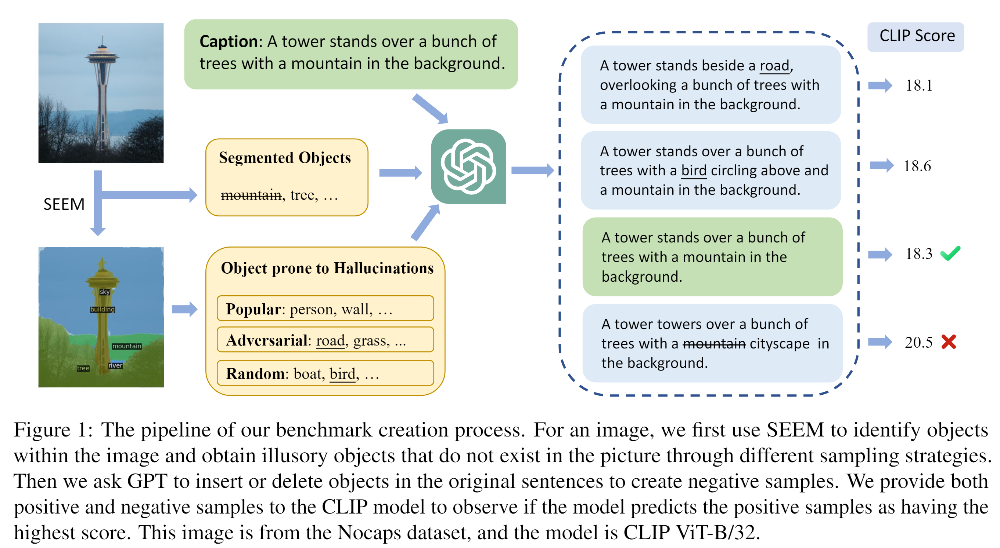

# Investigating and Mitigating Object Hallucinations in Pretrained Vision-Language (CLIP) Models

This repo provides the source code & data of our paper: [Investigating and Mitigating Object Hallucinations in Pretrained Vision-Language (CLIP) Models](https://arxiv.org/pdf/2410.03176v1). Checkpoints can be found in [here](https://huggingface.co/yfliu/llava_clip_ohd_caps_lora).



## OHD-Caps benchmark
Our constructed OHD-Caps dataset is designed to assess whether models can accurately distinguish between correct texts and texts containing hallucinations in comparative environments. We select 500 samples from each of the COCO, Flickr30k, and Nocaps datasets, and generated 27 negative samples for each which include hallucinations of various types and degrees, utilizing the script `utils/generate_negative_samples.py`.

The benchmark can be found in `data/OHD-Caps/test`.
Files with "annotations" in the filename contain more detailed information, including not only the negative samples but also the named objects that are inserted. Files without "annotations" are used only for format conversion in preparation for evaluation.
The file format in annotation files is as follows:
```
{
    "file_path": "file_path",
    "positive_sample": "caption",
    "adversarial_samples": {
      "object1": "caption1"
      ...
    },
    "popular_samples": {
      "object2": "caption2"
      ...
    },
    "random_samples": {
      "object3": "caption3"
      ...
    },
    "delete_samples": {
        "object4": "caption4"
        ...
      }
}

```

## Finetune
We provide the code for finetuning the CLIP model using in `finetune.py`. The script can be run with the following command:
```bash
cd finetune_clip
./run.sh $gpu_id
```
where `$gpu_id` is the GPU id to use. To fine-tune our model, the data we utilized consists of two parts. The first part is a dataset for compositional understanding tasks, which is obtained by running the `utils/generate_composition_data.py` script. The second part is a specially constructed dataset for hallucination detection, containing 16k samples, generated by the `utils/generate_negative_samples.py` script. Specifically, we extracted 8k samples each from the COCO training set and the Flickr dataset. All the data used for fine-tuning are stored in the `data/OHD-Caps/train` directory.

## Evaluation
The evaluation code of clip is adapted from https://github.com/amitakamath/whatsup_vlms. We add the evaluation code for hallucination detection and extends the code for huggingface models. The script can be run with the following command:
```bash 
cd evaluate_clip
python main_aro.py --model-name $model_name --dataset $dataset_name
```
where `$model_name` is the model name and `$dataset_name` is the dataset name. The hallucination detection datasets in OHD-Caps benchmark are named as `COCO_Object`, `Flickr30k_Object`, `Nocaps_Object`.

